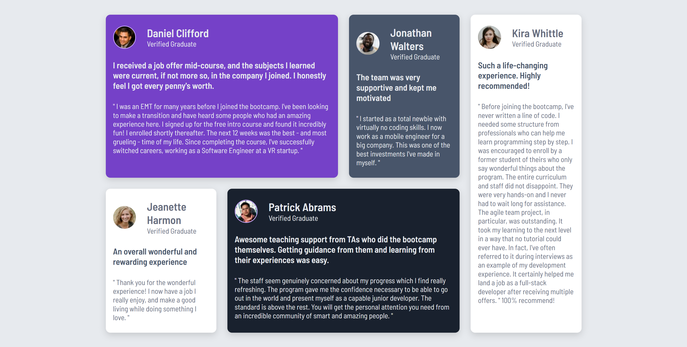

# Frontend Mentor - Testimonials Grid Section

This is a solution to the [Testimonials Grid Section challenge](https://www.frontendmentor.io/challenges/testimonials-grid-section-Nnw6J7Un7) on Frontend Mentor. The goal was to build a responsive testimonial section using HTML and CSS.

## 🛠 Built With

- HTML5 semantic elements
- CSS3 (Grid, Flex, custom properties, media queries)
- Mobile-first workflow
- Google Fonts: [Barlow Semi Condensed](https://fonts.google.com/specimen/Barlow+Semi+Condensed)

## 📱 Responsive Design

- ✅ Mobile layout: single-column cards stacked vertically
- ✅ Tablet layout (min-width: 768px): two-column grid
- ✅ Desktop layout (min-width: 1024px): four-column grid
- Fully responsive from small screens (320px) up to large desktops (1440px+)

## 📷 Screenshot

## 🚀 How to Use

1. Clone the repository
2. Open `index.html` in your browser
3. Edit `style.css` to customize colours, fonts, or spacing

## 💡 What I Learned

- How to create responsive layouts with **CSS Grid** and media queries
- How to span columns and rows for featured cards
- Importance of semantic HTML for structuring cards and sections
- Using `grid-column` and `grid-row` shorthand for cleaner code

## ✅ Author

- Frontend Mentor: [@TelmoManduco](https://www.frontendmentor.io/profile/TelmoManduco)
- GitHub: [@TelmoManduco](https://github.com/TelmoManduco)
